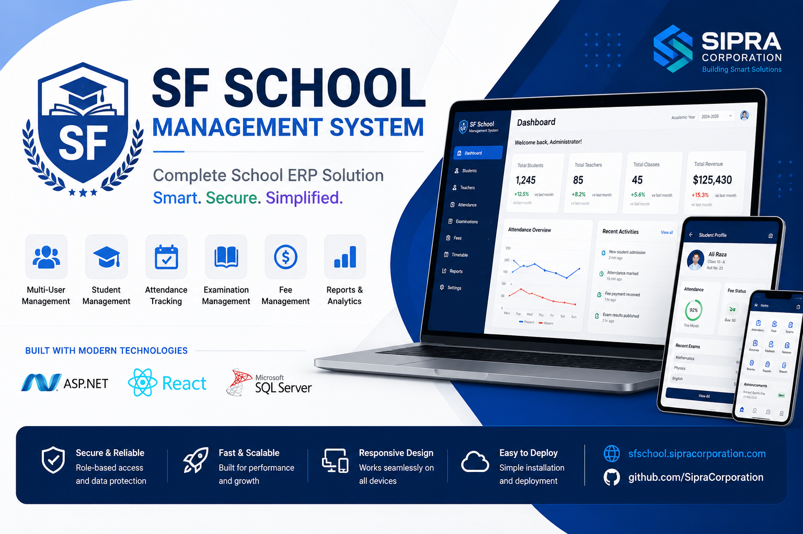

 # 🎓 SF School Management System



> Modern • Secure • Scalable School ERP Platform
>
# sfschool-management-system
Comprehensive School Management System developed by Sipra Corporation featuring admissions, attendance, examinations, fee management, HR, parent portal, teacher portal, and academic administration.
# Changelog

All notable changes to this project will be documented in this file.

## [1.0.0] - 2026-07-16

### Added
- Student Management
- Teacher Management
- Attendance
- Examination Module
- Fee Management
- Dashboard
- Reports
- Role-Based Authentication
 # Contributing

Thank you for your interest in contributing.

## Steps

1. Fork repository
2. Create feature branch
3. Commit changes
4. Push branch
5. Open Pull Request

Please follow coding standards and write clear commit messages.# Security Policy

## Reporting a Vulnerability

Please report security issues privately.

Email:
security@sipracorporation.com

Do not create public GitHub issues for security vulnerabilities.# Code of Conduct

Be respectful.

Be professional.

Support collaboration.

Harassment or abusive behavior will not be tolerated.MIT License

Copyright (c) 2026 Ahsan Raza Sipra

Permission is hereby granted, free of charge...## Description

Briefly describe your changes.

## Type

- Feature
- Bug Fix
- Improvement
- Documentation

## Checklist

- [ ] Code tested
- [ ] Documentation updated
- [ ] No breaking changesname: Build

on:
  push:
    branches: [ main ]
  pull_request:
    branches: [ main ]

jobs:
  build:

    runs-on: ubuntu-latest

    steps:
      - uses: actions/checkout@v4

      - uses: actions/setup-dotnet@v4
        with:
          dotnet-version: '8.0.x'

      - run: dotnet restore

      - run: dotnet build --configuration Release# System Architecture

## Overview

SF School Management System follows a modern client-server architecture.

```
Users
   │
   ▼
React Frontend
   │
REST API
   │
ASP.NET Backend
   │
Business Logic Layer
   │
Microsoft SQL Server
```

## Components

### Frontend
- React
- Responsive UI
- REST API Integration

### Backend
- ASP.NET
- Business Logic
- Authentication
- Authorization

### Database
- Microsoft SQL Server
- Relational Database
- Stored Procedures (if applicable)

## Authentication

- Custom Login
- Role-Based Access Control
- Secure Session Management

## Roles

- Administrator
- Principal
- Teacher
- Student
- Parent
- Accountant
- Receptionist# Installation Guide

## Clone Repository

```bash
git clone https://github.com/SipraCorporation/sfschool-management-system.git
```

## Backend

Open the ASP.NET solution.

Restore NuGet packages.

Run the project.

## Frontend

```bash
cd frontend

npm install

npm start
```

## Database

Create a SQL Server database.

Import the provided database script.

Update the connection string.

Run the application.# REST API

## Authentication

POST /api/login

POST /api/logout

## Students

GET /api/students

POST /api/students

PUT /api/students/{id}

DELETE /api/students/{id}

## Teachers

GET /api/teachers

POST /api/teachers

## Attendance

GET /api/attendance

POST /api/attendance

## Exams

GET /api/exams

POST /api/exams# Database

Database Engine

- Microsoft SQL Server

Main Tables

- Users
- Students
- Teachers
- Classes
- Subjects
- Attendance
- Exams
- Fees
- Results

Relationships

Students → Classes

Teachers → Subjects

Students → Attendance

Students → Results# Deployment

## Requirements

- IIS
- .NET Runtime
- SQL Server
- Node.js

## Steps

1. Publish ASP.NET project.
2. Build React project.
3. Configure IIS.
4. Configure SQL Server.
5. Update connection strings.
6. Launch application.# Security

Features

- Custom Authentication
- Role-Based Authorization
- Password Hashing
- Input Validation
- Secure API Access
- SQL Injection Protection
- XSS Protection
- HTTPS Support# User Guide

## Administrator

- Manage Users
- Configure Settings
- View Reports

## Teacher

- Mark Attendance
- Manage Students
- Enter Results

## Student

- View Attendance
- View Results
- View Timetable

## Parent

- Track Student Progress
- View Attendance
- View Results---

# 🔒 Source Code

The source code for this project is private because it contains proprietary business logic and commercial components developed by Sipra Corporation.

This repository is intended to showcase the project's architecture, features, technology stack, and documentation.

## 📞 Interested in this solution?

If you're interested in a live demonstration, customization, or a similar solution for your organization, feel free to get in touch.

- 🌐 Website: https://sfschool.sipracorporation.com
- 🏢 Company: https://sipracorporation.com
- 💼 LinkedIn: https://linkedin.com/in/ahsan-sipra
- 📧 Email: ahsan@sipracorporation.com    # 📸 Application Screenshots

## Home


---

## ERP Modules


---

## Role Based Dashboard


---

## User Roles


---

## Key Features


---

## Customers


---

## Contact


